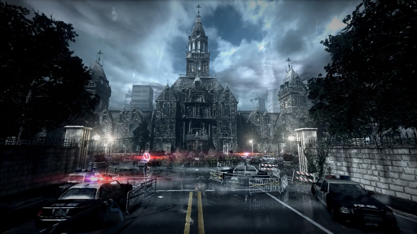

# Psyco_Break
ctf based on a game , challenging for me
# psyco break

nmap: 
PORT   STATE SERVICE VERSION
21/tcp open  ftp     ProFTPD 1.3.5a
22/tcp open  ssh     OpenSSH 7.2p2 Ubuntu 4ubuntu2.10 (Ubuntu Linux; protocol 2.0)
80/tcp open  http    Apache httpd 2.4.18 ((Ubuntu))
No exact OS matches for host (If you know what OS is running on it, see https://nmap.org/submit/ ).

hint got from source code
<!-- Sebastian sees a path through the darkness which leads to a room => /sadistRoom -->

got key form /sadistroom
Key to locker Room => 532219a04ab7a02b56faafbec1a4c1ea

hint from source page of /saddistroom

<!-- To find more about Sadist visit https://theevilwithin.fandom.com/wiki/Sadist -->

key found in /lockerroom

"Tizmg_nv_zxxvhh_gl_gsv_nzk_kovzhv" 

cipher used is atbash cipher
Grant_me_access_to_the_map_please

http://10.10.254.84/SafeHeaven/
applying gobuster on this url;

gobuster directory found /keeper
after doing some google reverse image lookup

 48ee41458eb0b43bf82b986cecf3af01

http://10.10.254.84/abandonedRoom/be8bc662d1e36575a52da40beba38275/herecomeslara.php?shell=ls%20..

680e89809965ec41e64dc7e447f175ab be8bc662d1e36575a52da40beba38275 index.php 

http://10.10.254.84/abandonedRoom/680e89809965ec41e64dc7e447f175ab

furthur challenge is extracting file from images and getting flags
tools we must know: exiftool,binwalk

got FTP credentials from joseph_oda.jpg
                                         \\
        ||      (NOTE) FTP Details                      ||
        ||      ==================                      ||
        ||                                              ||
        ||      USER : joseph                           ||
        ||      PASSWORD : intotheterror445             ||
        ||                                     

